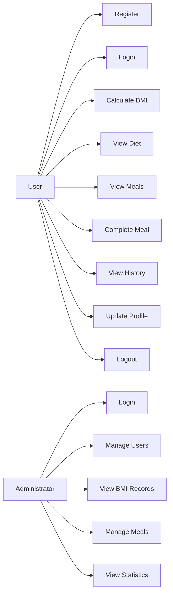
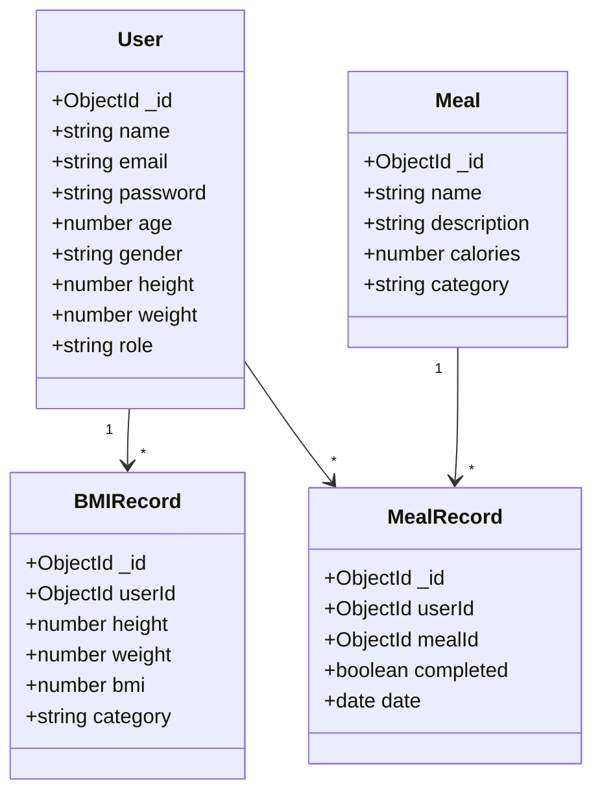
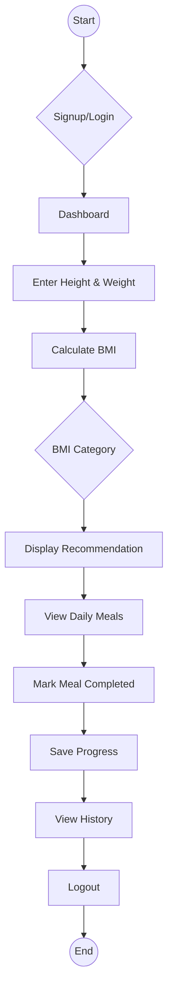
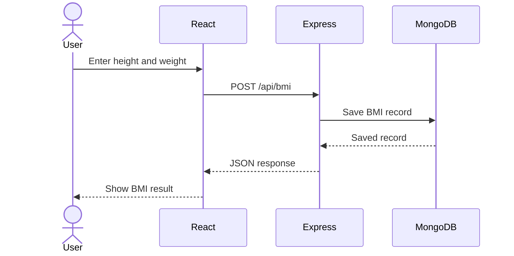

# UML Diagrams (Mermaid)

## Use Case Diagram

```mermaid
flowchart LR
U[User] --> R[Register]
U --> L[Login]
U --> B[Calculate BMI]
U --> D[View Diet]
U --> M[View Meals]
U --> C[Complete Meal]
U --> H[View History]
U --> P[Update Profile]
U --> O[Logout]
A[Administrator] --> AL[Login]
A --> MU[Manage Users]
A --> BR[View BMI Records]
A --> MM[Manage Meals]
A --> S[View Statistics]
```

## Class Diagram

```mermaid
classDiagram
class User {
  +ObjectId _id
  +string name
  +string email
  +string password
  +number age
  +string gender
  +number height
  +number weight
  +string role
}
class BMIRecord {
  +ObjectId _id
  +ObjectId userId
  +number height
  +number weight
  +number bmi
  +string category
}
class Meal {
  +ObjectId _id
  +string name
  +string description
  +number calories
  +string category
}
class MealRecord {
  +ObjectId _id
  +ObjectId userId
  +ObjectId mealId
  +boolean completed
  +date date
}
User "1" --> "*" BMIRecord
User "1" --> "*" MealRecord
Meal "1" --> "*" MealRecord
```

## Activity Diagram

```mermaid
flowchart TD
S((Start)) --> L{Signup/Login}
L --> D[Dashboard]
D --> I[Enter Height & Weight]
I --> C[Calculate BMI]
C --> Q{BMI Category}
Q --> R[Display Recommendation]
R --> M[View Daily Meals]
M --> X[Mark Meal Completed]
X --> DB[Save Progress]
DB --> H[View History]
H --> O[Logout]
O --> E((End))
```

## Sequence Diagram

```mermaid
sequenceDiagram
actor User
participant React
participant Express
participant MongoDB
User->>React: Enter height and weight
React->>Express: POST /api/bmi
Express->>MongoDB: Save BMI record
MongoDB-->>Express: Saved record
Express-->>React: JSON response
React-->>User: Show BMI result
```
